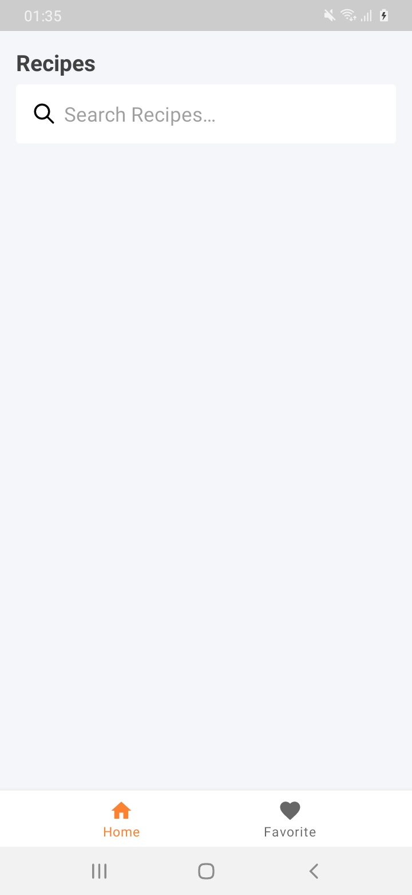
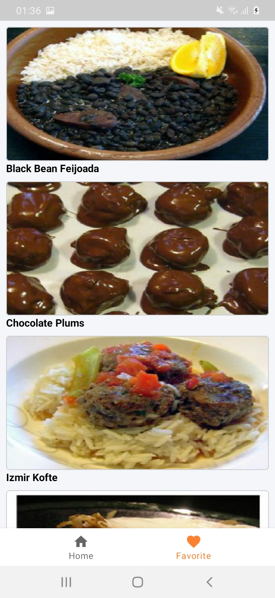
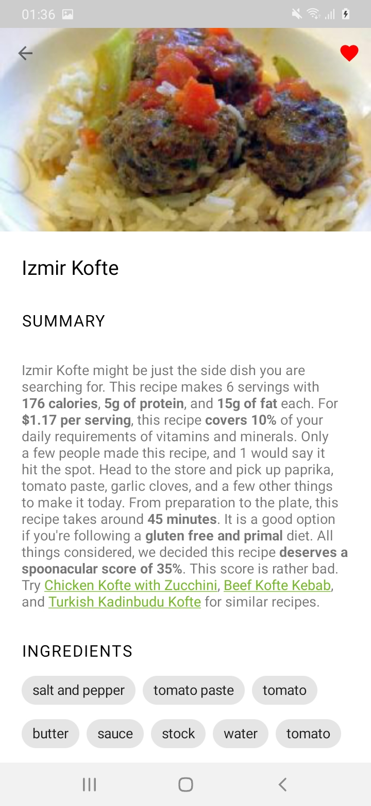

## Clue Submission App
This app is a simple application that allows the user to search for recipes. This app makes use of the [Spoonacular API](https://spoonacular.com/)

## Screenshots
||||

## Built With 🛠

- Android Studio 4.1.1+
- [Kotlin](https://kotlinlang.org/)
- [Kotlin DSL](https://proandroiddev.com/writing-dsls-in-kotlin-part-1-7f5d2193f277)
- [Coroutines](https://kotlinlang.org/docs/reference/coroutines-overview.html)
- [Flow](https://kotlin.github.io/kotlinx.coroutines/kotlinx-coroutines-core/kotlinx.coroutines.flow/-flow/)
- [Motion Layout](https://developer.android.com/training/constraint-layout/motionlayout)
- [Android Architecture Components](https://developer.android.com/topic/libraries/architecture) - Collection of libraries that help you design robust, testable, and maintainable apps.
  - [LiveData](https://developer.android.com/topic/libraries/architecture/livedata) - Data objects that notify views when the underlying database changes.
  - [ViewModel](https://developer.android.com/topic/libraries/architecture/viewmodel) - Stores UI-related data that isn't destroyed on UI changes.
  - [Room](https://developer.android.com/topic/libraries/architecture/room) - SQLite object mapping library.
  - [Navigation](https://developer.android.com/guide/navigation/navigation-getting-started) - Android Navigation Component
  - [ViewBinding](https://developer.android.com/topic/libraries/view-binding) - Generates a binding class for each XML layout file present in that module and allows you to more easily write code that interacts with views.

- [Dependency Injection](https://developer.android.com/training/dependency-injection) -
  - [Hilt-Dagger](https://dagger.dev/hilt/) - Standard library to incorporate Dagger dependency injection into an Android application.
  - [Hilt-ViewModel](https://developer.android.com/training/dependency-injection/hilt-jetpack) - DI for injecting `ViewModel`.

## Architecture
- This app uses [MVVM (Model View View-Model)](https://developer.android.com/jetpack/docs/guide#recommended-app-arch) architecture, repository pattern and clean architecture.

## How to make use of the app
- Create an account on [Spoonacular API](https://spoonacular.com/) to get an api key.
- Clone this repo,
- In `local.properties`, include this line `apiKey = <your key>`

### Created by Okonji Emmanuel